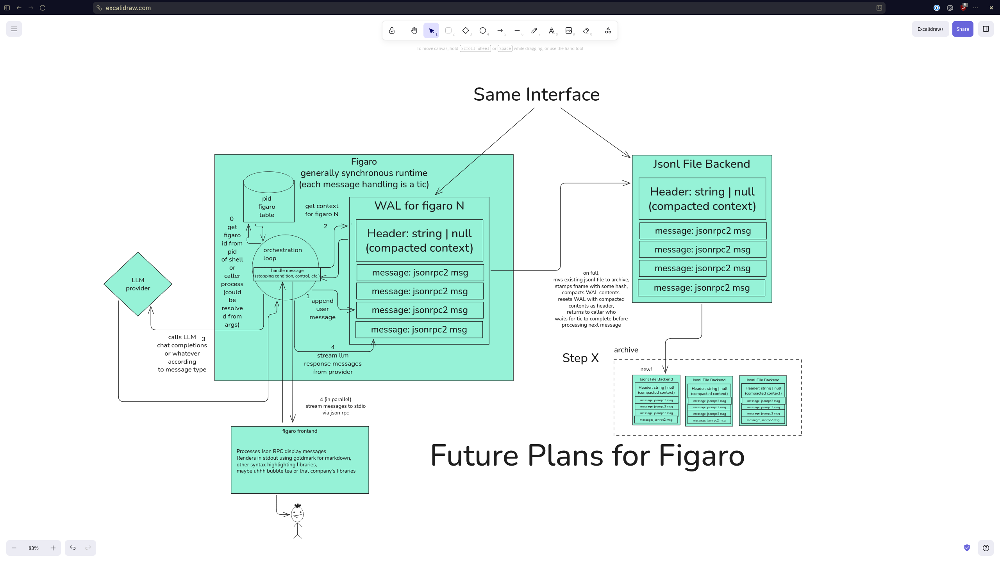

# Figaro: Design Plan

> *Largo al factotum della città!*



## Overview

Figaro is a minimal, Go-native coding agent. Each agent instance is called
a "figaro" (after the barber of Seville). The runtime manages a table of
figaros, each with its own conversation context and store.

## Core Architecture

### The Store Interface

One interface, implemented by all persistence layers:

```go
type Store interface {
    Context() []message.Message     // get ordered messages for LLM
    Append(msg) (string, error)     // add message, block until durable
    Branch(entryID) error           // fork from earlier point
    LeafID() string
    SessionID() string
    Close() error
}
```

Compaction is **internal** to the store — the agent loop never triggers it.
When the store decides it's time (entry count, token estimate), it compacts
on its own between tics.

### The Registry

Maps figaro IDs → Store instances. A figaro ID is resolved from shell PID,
caller process, or CLI args.

```go
type Registry interface {
    Get(figaroID string) (Store, error)
    List() []string
    Close() error
}
```

### The Orchestration Loop (State Machine)

The loop is synchronous, tic-based. Each tic processes one message:

```
                    ┌──────────────────────────┐
                    │    resolve figaro ID      │
                    │    (PID / args / env)     │
                    └────────────┬─────────────┘
                                 │
                    ┌────────────▼─────────────┐
                    │  registry.Get(figaroID)   │
                    │  → store for this figaro  │
                    └────────────┬─────────────┘
                                 │
                    ┌────────────▼─────────────┐
                    │  store.Append(userMsg)    │
                    │  (blocks until written)   │
                    └────────────┬─────────────┘
                                 │
              ┌──────────────────▼──────────────────┐
              │           TIC LOOP                   │
              │                                      │
              │  msgs := store.Context()             │
              │  last := msgs[len(msgs)-1]           │
              │                                      │
              │  switch last.Role:                   │
              │                                      │
              │  case user, tool_result:             │
              │    → send to LLM provider            │
              │    → stream response chunks          │
              │    → accumulate assistant message     │
              │    → store.Append(assistantMsg)       │
              │    → next tic                        │
              │                                      │
              │  case assistant:                     │
              │    if has tool calls:                │
              │      → execute each tool             │
              │      → store.Append(toolResultMsg)   │
              │      → next tic                     │
              │    if stop reason == "stop":         │
              │      → DONE, yield to user           │
              │    if stop reason == "error":        │
              │      → DONE, report error            │
              │                                      │
              └──────────────────────────────────────┘

In parallel with every store.Append():
  → stream the message as JSON-RPC 2.0 notification to stdout
```

### How pi's Agent Loop Works (for reference)

Pi's loop (agent-loop.ts) has the same bones:

1. **Outer loop**: runs until no more tool calls AND no pending messages
2. **Each turn**: stream assistant response → check for tool calls
3. **If tool calls**: execute sequentially, check for steering messages
   between each tool (user typed while tools were running). If steering
   arrived, skip remaining tools.
4. **If no tool calls**: check for follow-up messages (queued while
   streaming). If any, inject them and continue.
5. **Stop conditions**: `stopReason == "stop"` (model done),
   `"error"`, `"aborted"` (signal/ctrl-c)

Figaro simplifies this for step 1: no steering, no follow-ups, single
operator sending one message at a time. The tic loop is equivalent to
pi's inner loop with those features stripped out.

### JSON-RPC 2.0 Output

The figaro process writes newline-delimited JSON-RPC 2.0 **notifications**
to stdout as it works:

```jsonl
{"jsonrpc":"2.0","method":"stream.delta","params":{"text":"I'll fix","content_type":"text"}}
{"jsonrpc":"2.0","method":"stream.tool_start","params":{"tool_name":"bash","arguments":{"command":"ls"}}}
{"jsonrpc":"2.0","method":"stream.tool_end","params":{"tool_name":"bash","result":"main.go\ngo.mod"}}
{"jsonrpc":"2.0","method":"stream.message","params":{"entry_id":"00000003","message":{...}}}
{"jsonrpc":"2.0","method":"stream.done","params":{"session_id":"abc","reason":"stop"}}
```

Messages in the store are ALSO jsonrpc2 — same envelope. The stdout stream
is a live view of the same log the store persists.

### Message Format with Baggage

Each message carries the canonical (provider-agnostic) content plus an
opaque `baggage` map keyed by provider name. The originating provider
stashes its native response there so re-serialization on subsequent turns
is a cache hit, not a full conversion:

```go
type Message struct {
    Role       Role
    Content    []Content
    Model      string
    Provider   string
    Usage      *Usage
    StopReason StopReason
    Timestamp  int64
    Baggage    map[string]json.RawMessage  // "anthropic" → native wire format
}
```

---

## Step 1: Core Agent Loop (NOW)

**Goal**: figaro runs as a forked process from the shell, processes one
prompt, streams output, exits.

```
$ figaro --session abc123 "fix the bug"
```

What happens:

1. Resolve figaro ID from args (or generate from session ID)
2. Open JSONL store for that session (implements `Store` directly)
3. `store.Append(userMsg)` — writes to JSONL, blocks
4. Enter tic loop:
   - `store.Context()` → read full conversation
   - Last message is user → send to Anthropic
   - Stream response, `store.Append(assistantMsg)`
   - If tool calls → execute, `store.Append(toolResultMsg)`, next tic
   - If stop → exit
5. Every `Append` also writes a JSON-RPC notification to stdout
6. Process exits

**Deliverables**:
- [x] `store.Store` interface
- [x] `message.Message` with baggage
- [x] `provider.Provider` interface
- [x] `provider/anthropic` — raw HTTP+SSE, no SDK
- [x] JSON-RPC 2.0 notification types
- [ ] JSONL store implementation (implements `Store`)
- [ ] Tic-based orchestration loop (replaces current `agent.Agent`)
- [ ] CLI entrypoint with session resolution
- [ ] OAuth token support (Claude Max)
- [ ] Stdout JSON-RPC writer

## Step 2: In-Memory WAL (NEXT)

Insert `MemoryStore` between agent and JSONL:

```
agent ──► MemoryStore ──► JSONLStore ──► disk
```

- `MemoryStore.Context()` → serves from memory (fast)
- `MemoryStore.Append()` → writes to memory, flushes to JSONL periodically
- On startup, seeds from `JSONLStore.Context()` if WAL is cold
- Compaction happens in the WAL layer: when full, compacts contents,
  writes compacted header, resets, archives old JSONL

## Step 3: Daemon + Frontend (LATER)

- Long-running daemon holds the registry and warm stores
- CLI becomes thin client talking to daemon via unix socket
- Frontend process reads JSON-RPC from stdout (or socket)
- Renders with goldmark for markdown, bubbletea or similar for TUI
- Warm HTTP/2 connections to Anthropic

## Step X: Archive Rotation (FUTURE)

When WAL is full:
1. `mv` existing JSONL to archive (stamped with hash)
2. Compact WAL contents
3. Reset WAL with compacted header
4. New JSONL starts with just the compacted summary

Archive directory accumulates old JSONL files — the full history
is preserved but not loaded unless explicitly requested.
